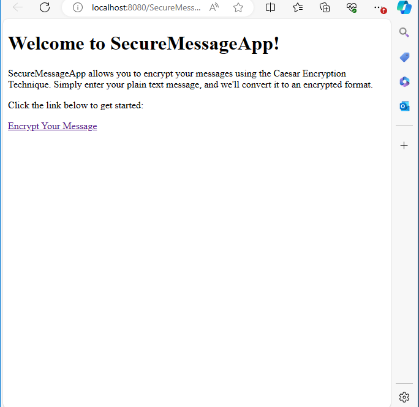
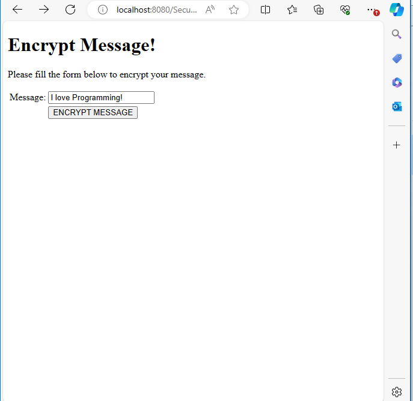
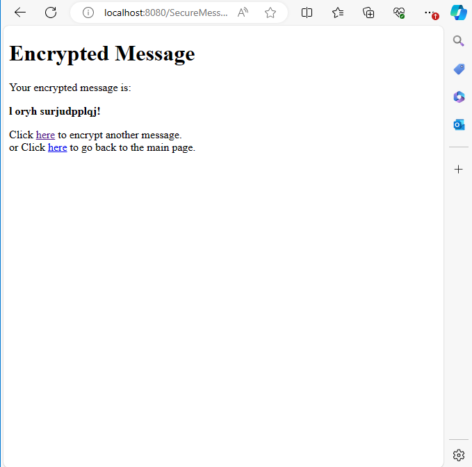

# SecureMessageApp

SecureMessageApp is a web application that allows users to send plain text messages to a server and receive back encrypted forms of the messages using the Caesar Encryption Technique (CET). This application is designed to help users securely communicate by converting readable data into unreadable encrypted messages.

## How It Works

### Model

The model is represented by the `EncryptMessage` class, which contains the business logic for generating an encrypted message based on the Caesar Encryption Technique.

### View

The views are the HTML and JSP pages:
- `index.html`: The home page.
- `input.html`: The input form where users enter their plain text messages.
- `output.jsp`: Displays the encrypted message.

### Controller

The controller is the `EncryptMessageServlet` which handles user input, processes the encryption using the model, and directs it to the appropriate view.

## Caesar Encryption Technique (CET)

Encryption is a data protection mechanism used to make readable data unreadable. The CET works as follows:
- All the letters in the plain text are first converted to lowercase letters.
- Each lowercase letter is replaced with a letter that is three spaces away from it in the alphabet. This means:
  - 'a' is replaced with 'd'
  - 'b' is replaced with 'e'
  - 'c' is replaced with 'f'
  - 'w' is replaced with 'z'
  - 'x' is replaced with 'a'
  - 'y' is replaced with 'b'
  - 'z' is replaced with 'c'

## License

This project is licensed under the MIT License. See the [LICENSE](LICENSE) file for details.

## Screenshots

*Figure 1: Screenshot of the Home Page*

*Figure 2: Screenshot of the Input Form*

*Figure 3: Screenshot of the Output Page*

